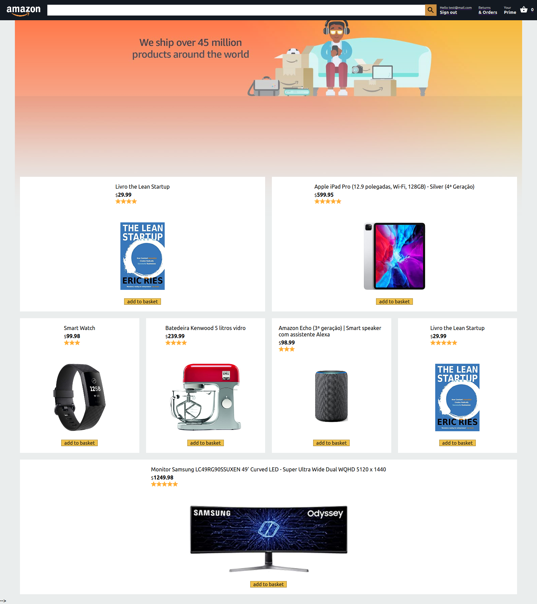

# Este é um projeto em React para estudos onde imita a interface estilizada para parecer o Amazon.com, utilizando o Firebase.

## O que ele faz?
Ainda em desenvolvimento... até o momento é possível:
>autenticar login utilizando o firebase authentication
>adicionar/remover itens ao carrinho, alterando quantidade e valor subtotal das props da basket
>UI responsiva com flex layout, estilizada e com navegabilidade por rotas
>acessar hitórico de pedidos (orders) de transações realizadas
>transação com cartão de crédito após o deploy e configuração da conta do Stripe

(obviamente requer Node.js, ok? ...então prepare seu ambiente =D )

Após clonar o repositório, instalar as dependências:

**npm i react-currency-format**

**npm install -save @material-ui/core**

**npm install -save @material-ui/icons**

**npm i firebase**

(não esqueça o sudo se estiver no Linux ;D )

no terminal, vá até a pasta do projeto:

**cd ~ user ~/projetos/react-amazon.clone**

inicie o projeto:

**npm start**

divirta-se!
